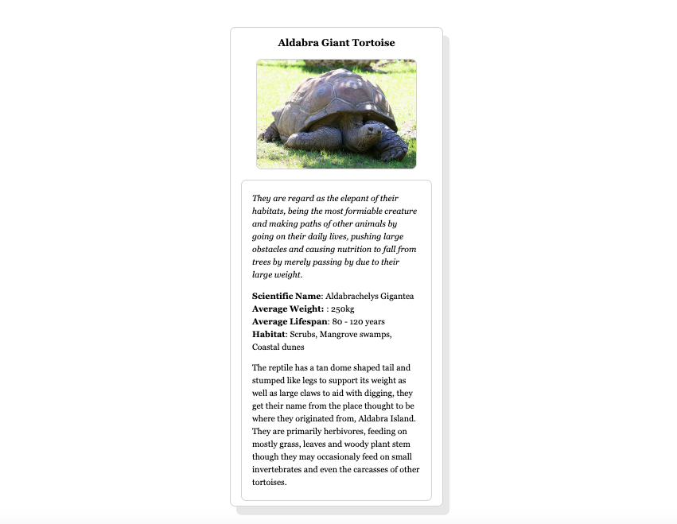

# Aldabra Giant Tortoise

## How To Open
1. Download project
2. Go into downloaded folder
3. Right click on file named _card.html_
4. Open project in browser of your choice

## How to use
1. Read card to find information on animal

## User Stories
+ Project is styled using external CSS

## Requirements
+ This project requires a browser to run

## Errors

## Additional Information
+ This project was made for Udacity's [Introduction To Programming Nanodegree](https://www.udacity.com/course/intro-to-programming-nanodegree--nd000)

## Preview
